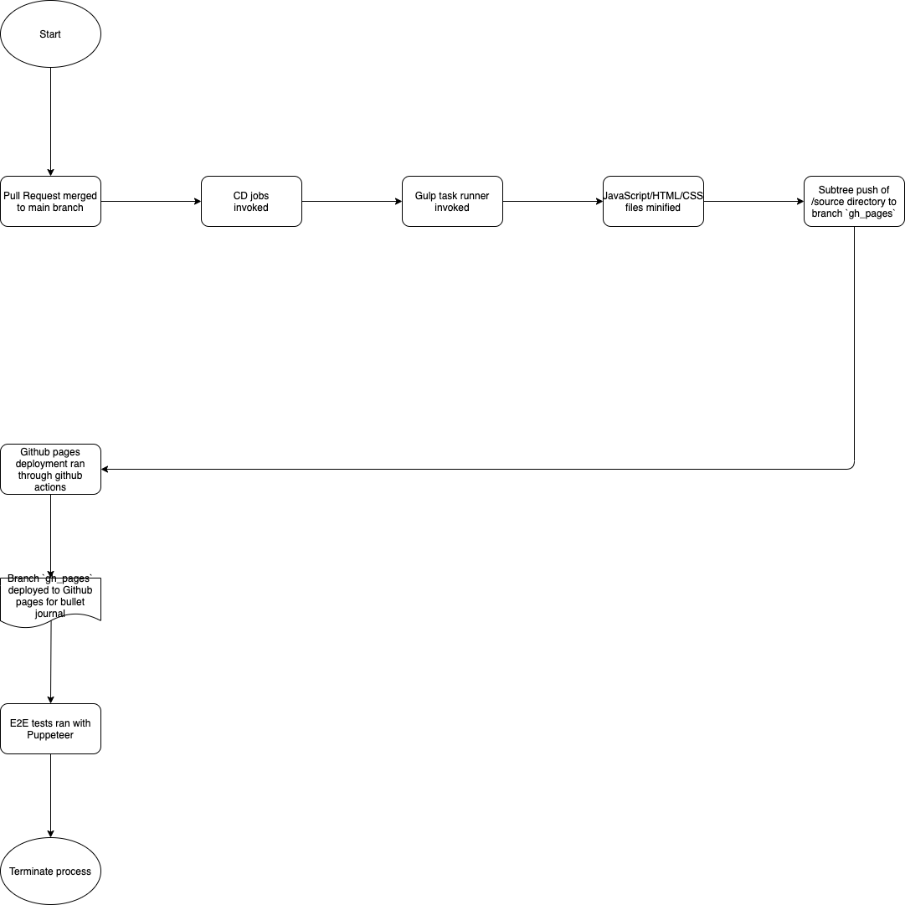

# CI Pipeline Phase One
## Introduction
This artifact is presented as an update to everyone on the status of the first iteration of our CI pipeline.
Included in this document is a flowchart describing our current CI pipeline, what is currently implemented, and
what we plan to include for the next iteration. It should be noted that the flowchart of our CI pipeline illustrates
what we envision as the final iteration.

## Diagram
Below is a flowchart illustrating our CI pipeline for phase 1:

## Current CI progress
The current process is explained as follows:
1. Version control process
   - Each team member works on a local clone of the group repository. Changes should be made on their own respective branch.
   - In order to streamline what is pushed onto the main branch, we enabled branch protections in order to prevent pushing changes locally to the main branch on the remote repository. Instead, team members push their changes to a remote branch corresponding to the branch worked on locally.
   - Once changes on a feature/experimental branch are ready to be merged with the main branch, a pull request is created. This is where the required status checks (unit tests, linting, code quality review, coverage, etc.) are verified. If any status check fails, we use branch protection in order to prevent merging the pull request.
2. CI process for pull requests
   - Once a pull request is initiated, the first status check that is done is for unit testing. For unit testing in our repository, we use Mocha for the testing framework, Chai as the assertion library, and Sinon for mocks/stubs/spies to test calls to our backend. Tests are located under `./source/javascript/tests/.`. This status check passes if all unit tests in this subdirectory are successful.
   - The second status check that is done is for linting. For our project, we use ESLint with StandardJS as our chosen style guide. This status check determines whether the code written underneath `./source/javascript/tests/.` and `./source/javascript/src/.` conforms to the StandardJS styleguide. (We should note that we included additional config information for ESLint in order to alleviate some issues presented with unused, but necessary, variables for unit testing with Chai)
   - The third status check is for code quality. We decided to use CodeClimate for benchmarking code quality. For our setup, we permitted CodeClimate to make comments directly onto pull requests to provide a summary of any associated code smells, complexity, etc.
   - The fourth status check is for documentation generation. This status check verifies that we are still able to generate documentation for our project under the `./source/javascript/src/.` subdirectory to the target subdirectory `./specs/ci-cd/docs/.`. Consequently, this status check fails in the instance where source files are misplaced or if our build process with Node is outdated. In order to remove the bloat associated with commits for pull requests, it should be noted that we included `./specs/ci-cd/docs/.` in our `.gitignore` file. This documentation can still be accessed locally.

## Progress for phase 2:
Below is a flowchart illustrating our CI pipeline for phase 2. Since we got our CI pipeline to function during phase one, this diagram is very similar to phase 1:

1. Granular control for CodeClimate checks with `.codeclimate.yml` file. Many members of our team were having issues with CodeClimate's [cognitive complexity](https://docs.codeclimate.com/docs/cognitive-complexity) in addition to method line count. On the other hand, we also had issues with Code Climate not picking up on code that is repeated in multiple files (this was sometimes getting by the status checks for pull requests). Consequently, we decided to fine-tune what aspects should be strongly enforced and what should be relaxed in a config file and include it in our CI pipeline.
2. Removed suggestion for preventing `@TODO/FIXME` markers. Since a lot of high-priority issues with indexedDB are still in progress, we often leave these markers to help supplement what needs to be done for issues listed on our KanBan board. This was also a suggestion made by Jordan during week seven's discussion.
3. Worked on adding minification. During week 9's discussion, we asked Jordan if it would be fine to look into minifcation since our CI/CD pipeline has all the core features we wished to include. Our phase one pipeline did not include it, but we wish to include additional deployment features for the completed bullet journal. This part of the pipeline should include some form of minification. The best option we looked into is [minify](https://www.npmjs.com/package/minify), but one of our group members mentioned that using this package would be easiest when integrated with a task runner like [Gulp](https://gulpjs.com/) instead of npm scripts, since the minify package is driven by Promise-based behavior. Consequently, we leave this as a stretch goal for the final evaluation of our CI/CD pipeline.

## Progress for final phase:
Below is a flowchart illustrating our CD pipeline for the final phase. As a high level overview, we are using Github pages for deployment.

Our progress is explained as follows:
1. Deployment with Github actions. We intially explored deploying with [Heroku](https://devcenter.heroku.com/categories/deployment) or inside of a [Docker container](https://docs.docker.com/get-started/overview/). Our initial reasoning for this is that we initially believed that Github pages does support cross origin resource sharing (CORS), which was needed in order to use a [ResT API to generage quotes for the daily log page](https://github.com/lukePeavey/quotable). However, since CORS support has been included in Github pages since 2020, we decided to write a new Github action to perform a [subtree push](https://gist.github.com/SKempin/b7857a6ff6bddb05717cc17a44091202) of the `source/` directory to a branch called `gh_pages`. This branch can consequently be used for deploying to production with Github pages.
2. Integrated [Gulp](https://gulpjs.com/) as a task runner. As iterated on in phase two, we had issues with JavaScript/HTML/CSS minification modules for Node not having great CLI support. However, [terser](https://www.npmjs.com/package/terser), [gulp-htmlmin](https://www.npmjs.com/package/gulp-htmlmin), and [gulp-clean-css](https://www.npmjs.com/package/gulp-clean-css) all have great support for minification. Consequently, we integrated Gulp for running tasks related to minification prior to deploying to Github pages.

Furthermore, below is a flowchart illustrating our CI pipeline for the final phase.

Our progress is explained as follows:
1. Decoupled JSDocs as a status check for pull requests. In hindsight, we should not be generating JSDocs during pull requests and should only do so when new code is approved and merged into `main`. For our final phase of the CI pipeline, we modified our CI jobs so that JSDocs are generated under `specs/programming_docs` when code is pushed to `main`.
2. Removed code coverage threshold from the status check requirement. Note that code coverage will still run as a status check during pull requests. However, due to the fact that we started unit testing late in the quarter, we instead used the npm module [istanbul](https://www.npmjs.com/package/istanbul) to simply report on coverage. For future improvements, we would like to employ unit testing to a much larger extent so that we can take greater advantage of the code coverage check during pull requests.
