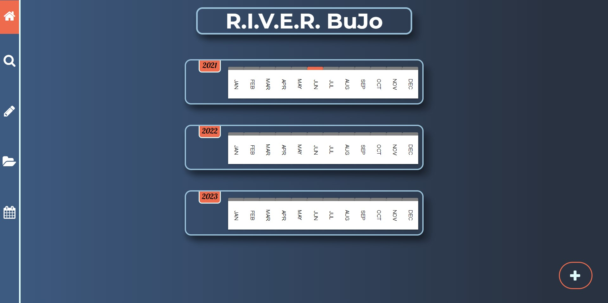
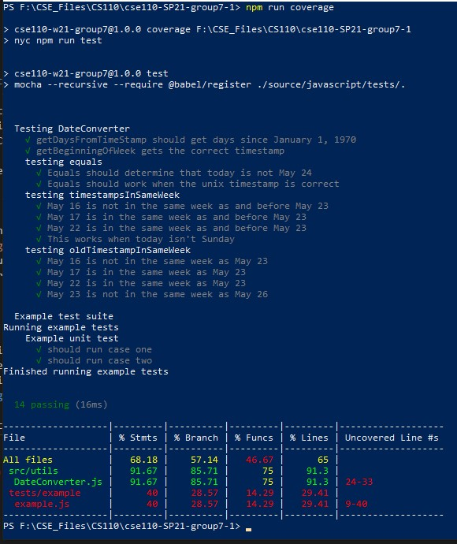

# CSE110 Group 7 - RIVER

Welcome to the CSE 110 Group 7 GitHub Repository! Our team is called RIVER, which is an acronym for Reflection, Improvement, Values, Empowerment, and Refinement. Throughout the spring quarter, we have created a digital Bullet Journal. 

Learn more about each of our members and our goals on the [RIVER Team Page](admin/team.md).

## Team River's Bullet Journal: 
You can access the app [here](https://cse110-w21-group7.github.io/cse110-SP21-group7/)    
  

## Final project videos
- [Final video: public version](https://youtu.be/U-Qt9tbzNeA)
- [Final video: private version](https://youtu.be/eA0CEhSUY8E)

## CI/CD Pipeline Information and Documentation:
All of the information about the CI/CD pipeline can be found [here](https://github.com/cse110-w21-group7/cse110-SP21-group7/tree/main/admin/cipipeline). In this folder, you can see the full [writeup](admin/cipipeline/phase1.md), [video](admin/cipipeline/phase1.mp4), and accompanying flowcharts for [phase 1](admin/cipipeline/phase1.png), [phase 2](admin/cipipeline/phase2.png), and both flowchart updates for [phase 3 CI](https://github.com/cse110-w21-group7/cse110-SP21-group7/blob/main/admin/cipipeline/phase3_ci.png) and [phase 3 CD](https://github.com/cse110-w21-group7/cse110-SP21-group7/blob/main/admin/cipipeline/phase3_cd.png).

## Design

We keep all of the design documentation of our RIVER Bullet Journal app inside the **/specs** folder.

- See our 15 **architecture decision records [(ADR)](https://github.com/cse110-w21-group7/cse110-SP21-group7/tree/main/specs/adr)**.

- You can find our pitch document at this [link](https://github.com/cse110-w21-group7/cse110-SP21-group7/tree/main/specs/pitch). In this file, we go over our team's problem statement, problem constraints, proposed design, early iterations of our design, rabbit holes, and No-gos.

- Our team came up with multiple UI versions of RIVER Bullet Journal together, you can find them [here](https://github.com/cse110-w21-group7/cse110-SP21-group7/tree/main/specs/interface)!

- For our style guidelines, we used ESLint and [JSDocs](https://github.com/shri/JSDoc-Style-Guide) to ensure all contributors have the same style, and we enforced the style automatically in our CI/CD pipeline as a status check. The following commands can be used in order to lint the files in our project:
  - ```npm run lint_src``` can be used to lint all the existing source files (under `source/javascript/src/.`). If nothing is returned, this indicates that every file follows the agreed-upon style guide.
  - ```npm run fix_src``` can be used to fix some of the linting errors in the existing source files (under `source/javascript/src/.`). Again, if nothing is returned, this indicates that every file follows the agreed-upon style guide.

  - ```npm run lint_tests``` can be used to lint all the existing test files (under `source/javascript/tests/.`). If nothing is returned, this indicates that every file follows the agreed-upon style guide.
  - ```npm run fix_tests``` can be used to fix some of the linting errors in the existing test files (under `source/javascript/tests/.`). Again, if nothing is returned, this indicates that every file follows the agreed-upon style guide.

- To design this website, we created 5 [user personas](https://github.com/cse110-w21-group7/cse110-SP21-group7/tree/main/specs/users) for potential users of the RIVER journal.

## Sprints
Once we finished our rough design of the website, we moved on to implementing our RIVER Bullet Journal. To realize our project, we collectively had three sprints. Each sprint was influenced heavily by the agile process model. Our team adopted the use of a KanBan board to help with transparency for tasks, but intentionally did not use story points; since most of the tools and technologies were new to us, it was difficult to quantify as a team the number of story points each issue should have. Since agile is an iterative process, we intentionally kept sprints to one week cycles so that we could get more experience with sprint planning (and managing expectations on what is realistic to get done in a single sprint), retrospectives, and sprint reviews. For our workflow, we employed sprint planning after retrospectives in order to create new issues for the sprint backlog and assigned issues based on everyones' bandwidth for the upcoming week.

- Sprint 1
  - [Assign roles](https://github.com/cse110-w21-group7/cse110-SP21-group7/blob/main/admin/standups/standup_may6.md)
  - [Retrospective](https://github.com/cse110-w21-group7/cse110-SP21-group7/blob/main/admin/meetings/051521-retrospective.md)
  - [Review](https://github.com/cse110-w21-group7/cse110-SP21-group7/blob/main/admin/meetings/051521-sprint-review.md)
  
- Sprint 2
  - [Retrospective](https://github.com/cse110-w21-group7/cse110-SP21-group7/blob/main/admin/meetings/052221-retrospective2.md)
  - [Review](https://github.com/cse110-w21-group7/cse110-SP21-group7/blob/main/admin/meetings/052221-sprint-2-review.md)

- Sprint 3
  - [Retrospective](https://github.com/cse110-w21-group7/cse110-SP21-group7/blob/main/admin/meetings/052921-retro3.md)
  - [Review](https://github.com/cse110-w21-group7/cse110-SP21-group7/blob/main/admin/meetings/052921-sprint-review-3.md)
  
- Final [Retro](https://github.com/cse110-w21-group7/cse110-SP21-group7/blob/main/admin/meetings/060621-finalRetro.md)
## Admins
- You can find our team 7 branding [here](https://github.com/cse110-w21-group7/cse110-SP21-group7/tree/main/admin/branding).
- All of the standup records are in the [standups](https://github.com/cse110-w21-group7/cse110-SP21-group7/tree/main/admin/standups)   folder (We had standups every Tuesday, Thursday, and Saturday).
- We keep all of our meeting notes in the [meetings](https://github.com/cse110-w21-group7/cse110-SP21-group7/tree/main/admin/meetings) folder.
- You can also check out our status video [here](https://github.com/cse110-w21-group7/cse110-SP21-group7/tree/main/admin/videos).

## Source
  Inside the [Source](https://github.com/cse110-w21-group7/cse110-SP21-group7/tree/main/source) folder, you can find all the sources that we used in building this RIVER Bullet Journal web application. All files are categorized by their file types into different subdirectories. The following are links to the directories for [Javascript](https://github.com/cse110-w21-group7/cse110-SP21-group7/tree/main/source/javascript), [HTML](https://github.com/cse110-w21-group7/cse110-SP21-group7/tree/main/source), and [CSS](https://github.com/cse110-w21-group7/cse110-SP21-group7/tree/main/source/css). 


## Testing
For testing our code, we use Mocha, Chai, Sinon to ensure the quality of our app. For our end to end testing, we use Puppeteer to ensure the user flow from page to page was correct for all navigations throughout the site. While we started testing during week 10, most of our unit testing efforts went into ensuring ensuring a utility class [DataConverter](https://github.com/cse110-w21-group7/cse110-SP21-group7/blob/main/source/javascript/src/utils/DateConverter.js) works properly. This is due to the fact that UNIX timestamps are used across each page of our bullet journal in order to determine what entries should be displayed.
- With regards to testing, we included three npm scripts in order to have more granular control over what to test. For E2E, ```npm run test_e2e``` can be run. This command runs our E2E tests against the production site [here](https://cse110-w21-group7.github.io/cse110-SP21-group7/), and is used in our CI/CD pipeline to ensure our production site is deploying as intended. For unit testing, ```npm run test_unit``` can be run, which will run the existing unit tests for the project. This command is also used during our CI/CD pipeline as an added status check that runs before pull requests can be merged into `main`.
- We use [istanbul](https://istanbul.js.org/) for code coverage in our project. This allows us to see the amount of code coverage we have with unit tests. In order to generate a coverage report, ```npm run coverage``` can be run.
  

## Documentation
We integrated documentation into our CI/CD pipeline so that when new pull requests are approved and merged into `main`, the branch [programming-docs](https://github.com/cse110-w21-group7/cse110-SP21-group7/tree/programming-docs) contains a subtree push of the documentation for our code. By keeping documentation on the repository in its own branch, this ultimately supports our goal of maintaining a single source of truth for all aspects of the project. In order to generate documentation for development purposes, the npm script `npm run docs` can be run, which will generate documentation in `specs/programming_docs`.

## Contribute to this project
If you want to contribute to our RIVER Bullet Journal Project, please follow the instructions below.
Team RIVER unanimously adopted a workflow for resolving bugs, implementing new features, as well as any other miscellaneous tasks. The following section outlines the instructions for contributing:

### Our workflow process
1. When working on the RIVER bullet journal, first check our [KanBan board](https://github.com/cse110-w21-group7/cse110-SP21-group7/projects/1) in order to see which issues are currently being worked on by someone else.
2. For issues with no assignment, feel free to assign yourself. When working on the issue, please move it to the `In Progress` column to promote transparency during our sprints.
3. If no issue exists for the problem or feature being considered, feel free to create a new issue [here](https://github.com/cse110-w21-group7/cse110-SP21-group7/issues). When creating issues, please use the bug report template for bugs and steps to reproduce the unexpected behavior. Otherwise, use the report template titled `Custom Issue Template`.
4. When creating issues, please assign the appropriate labels to the issue so that our team understands who would be best for its assignment.

### Our version control process
1. Clone this repository to the intended working directory with ```git clone https://github.com/cse110-w21-group7/cse110-SP21-group7.git```.
2. Our repository has branch protections set in place. As such, all development is done on personal branches. For development purposes, a branch should be made titled ```git branch [name]-branch```, where [name] denotes the name of the contributor.
3. Before making any changes to this project, use ```git checkout [name]-branch``` to ensure the correct branch is being used for development.
4. After noteworthy changes to the project on your working directory, commit the relevant changes and push to the remote repository using ```git push origin [name]-branch```.
5. Submit a pull request with Github to merge `[name]-branch` with `main`. Furthermore, please add the appropriate labels to the pull request and link the resolved issues to the pull request itself. During this point, status checks for testing, coverage, linting, and code quality with [CodeClimate](https://codeclimate.com/) will be performed. In the instance where any of these status checks fail, the npm scripts `npm test`, `npm run lint_src`, `npm run fix_src`, and `npm run coverage` can also be run locally to determine where the necessary revisions must be made.
7. Team RIVER employs pull request reviews of at least one reviwer for each pull request into `main`. After the required status checks have passed, one of our existing contributors will take a look at your changes and determine if revisions need to be made.

### Configuring your local repository for development
1. Our repository contains a utility class `source/javascript/src/utils/Router.js`, which helps with routing between pages, encoding and decoding URL's, and passing the correct query parameters to surface entries on each page. Since we currently do not have a config file in place to change between development and production routes, this must be done prior to making changes locally (given another week, this is actually the first thing our team wanted to include ~(: ). To do so, navigate to `source/javascript/src/utils/Router.js` and change the `prod` flag to `false`. This prefixes the routes utilized in this project so that navigation works in a development and production environment.
2. Prior to committing code, ensure that `source/javascript/src/utils/Router.js` has the `prod` flag switched to `true`. This ensures that pull requests merged into main do not use development routes on our deployed production site.

### For writing E2E tests
1. It is important enough to note that when writing E2E tests, entry points for navigation should be targeted at our production site https://cse110-w21-group7.github.io/cse110-SP21-group7/ instead of localhost. This is due to the fact that automation for E2E is integrated into our CD pipeline and runs these tests in a virtual machine. (In the future, our team ideally would like to integrate E2E into our CI pipeline instead by using [Docker containers](https://docs.docker.com/get-started/overview/))

## Our CI/CD pipeline stack
- Our CI/CD pipeline is powered through the use of Github actions (for webhooks and Github pages deployment) and Gulp (our task runner for intermediate steps before deployment). While we initially wanted to stick to npm scripts for our entire project, we ultimately used Gulp in order to facilitate minifying all JavaScript, HTML, and CSS files prior to deployment.
  - For Github actions, we use a [subtree pushing plugin to deploy to Gitub pages](https://github.com/marketplace/actions/github-pages). We also use a [set timezone action](https://github.com/szenius/set-timezone). This is due to the fact that our unit tests use timestamps in locale time; we consequently need control over the timezone being used by the virtual machine running the jobs for testing.
  - For Gulp, we used [gulp-clean-css](https://www.npmjs.com/package/gulp-clean-css), [gulp-htmlmin](https://www.npmjs.com/package/gulp-htmlmin), and [gulp-terser](https://www.npmjs.com/package/gulp-terser) for minification.

## Deploying the APP
- The RIVER Bullet Journal is published through GitHub Pages, so once the changes in the pull requests are merged, the changes to the web app can be seen right away. From our CD pipeline, when new pull requests are merged into `main`, [cd.yml](https://github.com/cse110-w21-group7/cse110-SP21-group7/blob/main/.github/workflows/cd.yml) is ran. This workflow contains the job needed for deployment to Github pages and for automating our E2E tests. With regards to Github pages deployment, the deployed site can be viewed on the branch [gh-pages](https://github.com/cse110-w21-group7/cse110-SP21-group7/tree/gh-pages).
